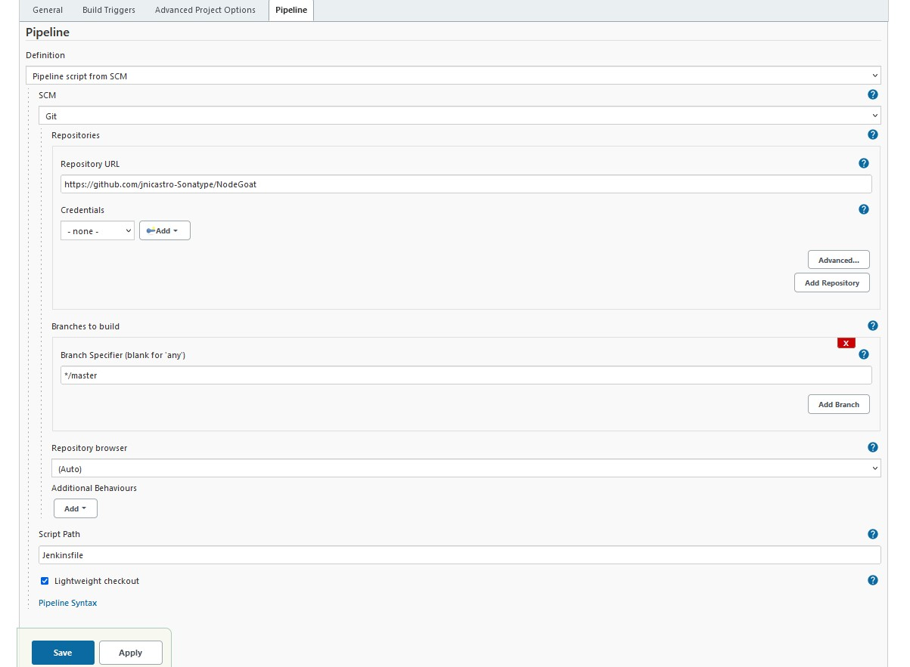
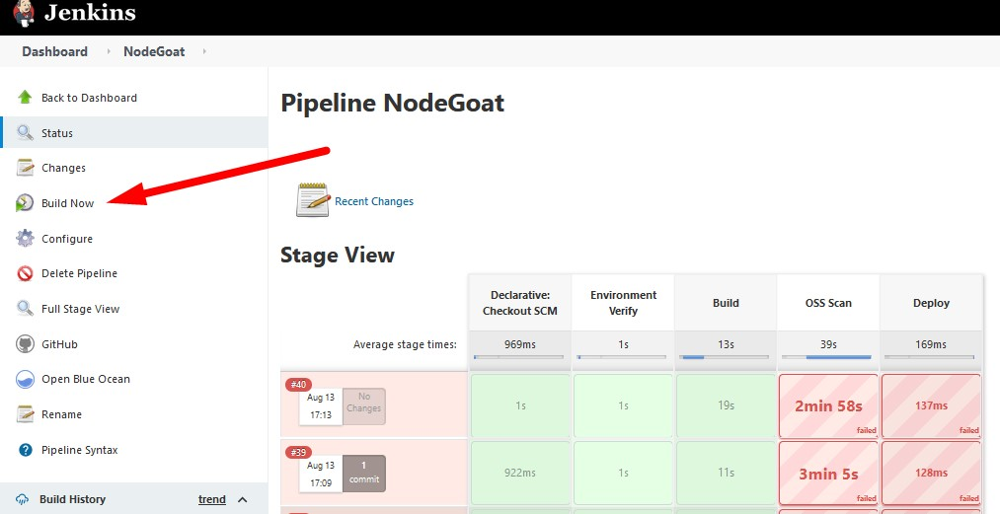

# Introduction

This project is designed to show how Sonatype can integrate into a build process with the Nexus Lifecycle CLI tool.  This complete process will include:

* building and packaging the app for scanning
* downloading the latest version of Sonatype's Nexus Lifecycle CLI tool
* running a Sonatype OSS scan for vulnerabilities, as well as license and architecture issues and provide the results both in the platform as well as directly in the CLI for   further automation steps if needed. 
* building a Docker image for deployment (Only if the previous step either shows no vulns or you code in a continue on error provision)

This is a Sonatype-specific readme file.  For the original, see README-original.md.

# How to use this

You have 2 options:

1. build from the existing repo (not making any modifications)
2. create a copy (fork) the existing repo for the ability to make your own mods and then build your modified copy

### 1. Get Jenkins ready

You will need the following plugins added to Jenkins, beyond what's already here in the 2019.4 images:

* Pipeline Utility Steps
* NodeJS
* AnsiColor

Goto Jenkins --> Manage Jenkins --> Manage Plugins and add these

For Windows only, you will probably need to tell git to handle long filenames (you will see an error during the git clean phase of the build about 'filename too long').  To do this, open a Cmd or Powershell prompt and enter:
``` git config --system core.longpaths true``` and then restart Jenkins (http://localhost:8082/restart).  Ignore any scary error messages, reload the page if necessary.  Jenkins will take about a minute to restart.

### 2. Configure the tools

Goto Jenkins --> Manage Jenkins --> Global Tool Configuration and setup the tools

#### 2.1 NodeJS

Add a NodeJS installation like the following (the names are important, so match them). 


### 3. Configure Credentials in Jenkins 

Goto Jenkins --> Manage Jenkins --> Configure Credentials --> Credentials and add the following to the Jenkins store, global domain:

#### 3.1 login

Add a 'username with password' credential with the following:

The username is your IQ_ID and the password is your IQ_Key.  The ID field must be "IQ_Login" (to match the Jenkinsfile).  The Description field can be anything.


### 4. Create the Jenkins job

Create a Jenkins Pipeline job with the following Pipeline section (you can ignore all the other fields):



### 5. Build w/Jenkins

Click Build Now to run the job.



## Deploying 

This step is only needed if you have "Continue on Error" setup, otherwise the OSS scan should fail as there are policy violations NodeGoat which is expected. 
